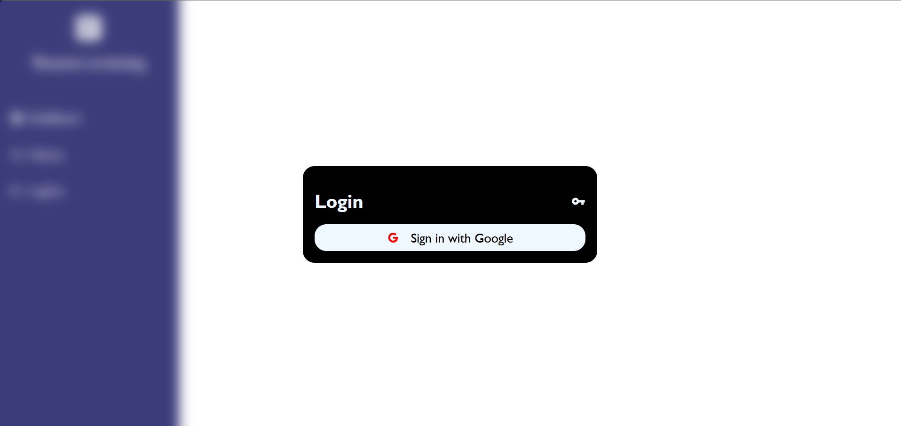

# Smart Resume Screening

Smart Resume Screening is a web application that analyzes resumes against job descriptions using AI.  
It provides a resume match score, personalized feedback, and improvement suggestions to help users tailor their resumes for specific job roles.

---

## Tech Stack Used

### Frontend


### Backend


### AI Integration


---

## Features

- Google Authentication for secure login  
- Resume upload in PDF format  
- Job description input field for target role  
- AI-powered resume analysis with match score and feedback  
- History section showing all past analyses for a user  
- Admin dashboard showing all uploaded resumes  
- Logout functionality for secure session handling  

---

## Workflow

1. **Login**  
   Sign in securely using Google authentication.

2. **Upload Resume**  
   Click on "Upload Resume" and select a PDF file to upload.

3. **Add Job Description**  
   Paste the job description in the input field.

4. **Analyze**  
   Click on the "Analyze" button to generate your resume match score and improvement suggestions.

5. **History Page**  
   View your previous resume analyses and reports.

6. **Admin Page**  
   Admin users can view all resumes uploaded by all users.

7. **Logout**  
   Safely log out from the application.

---

## Screenshots

### Login Page


### Dashboard Page


---

## Installation and Setup

### 1. Clone the Repository
```bash
git clone https://github.com/Sristy-72/Smart-Resume-Screening.git
cd Smart-Resume-Screening
